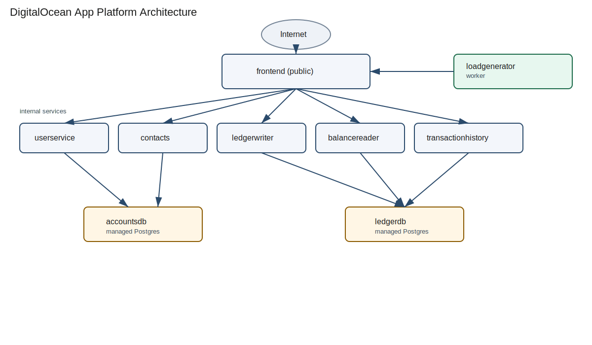

# Bank of Anthos on DigitalOcean App Platform

This repository is a migration example from Kubernetes to DigitalOcean App Platform. It packages the Bank of Anthos microservices as App Platform services and workers, uses managed Postgres, and deploys via GitHub Actions.

## App Platform architecture



Only the `frontend` service is public. All other services are internal and communicate over App Platform service DNS (for example, `userservice:8080`). The `loadgenerator` runs as a worker to produce traffic for dashboards.

## Components

| Component | Runtime | Purpose |
| --- | --- | --- |
| frontend | Python | Public web UI and API gateway to internal services. |
| userservice | Python | User auth and JWT signing. |
| contacts | Python | Contact list for payments and deposits. |
| ledgerwriter | Java | Writes transactions to the ledger. |
| balancereader | Java | Reads cached balances from ledger. |
| transactionhistory | Java | Reads transaction history from ledger. |
| accountsdb | Managed Postgres | User accounts and contacts data. |
| ledgerdb | Managed Postgres | Transaction ledger data. |
| loadgenerator | Python/Locust | Generates traffic against the frontend. |

## Kubernetes to App Platform mapping

| Kubernetes (original) | App Platform (this repo) | Notes |
| --- | --- | --- |
| Deployments (frontend) | Service (public) | App Platform ingress replaces Ingress/Service. |
| Deployments (internal APIs) | Services (internal) | `internal_ports` for private routing. |
| Deployment (loadgenerator) | Worker | No public ingress, produces load and metrics. |
| ClusterIP Services | Internal service discovery | `frontend` calls `userservice:8080`, etc. |
| ConfigMaps + Secrets | App Platform envs + secrets | Defined in `.do/deploy.template.yaml`. |
| Postgres Deployments + PVCs | Managed Postgres | Bindable vars injected at runtime. |

## Run locally (devcontainer)

Requirements: Docker + Devcontainer CLI (or VS Code "Reopen in Container").

1. Create `.env.secrets` with JWT keys:
   ```sh
   cat > .env.secrets <<'EOF'
   JWT_PRIVATE_KEY=replace-me
   JWT_PUBLIC_KEY=replace-me
   EOF
   ```
   If you need keys, see `extras/jwt/README.md`.
2. Start the local stack:
   ```sh
   ./scripts/start-local.sh
   ```
   Optional load generation:
   ```sh
   RUN_LOADGEN=true LOADGEN_USERS=10 LOADGEN_SPAWN_RATE=2 ./scripts/start-local.sh
   ```
3. Open `http://localhost:8080` in your browser.

To stop local services:
```sh
./scripts/stop.sh
```

## Run on DigitalOcean App Platform

### Prereqs

- `doctl` authenticated
- `gh` authenticated
- A DigitalOcean project ID

### Step-by-step

1. Set repo and environment:
   ```sh
   export REPO="your-org/bank-of-anthos-codex-app-platform"
   export ENV="staging"
   ```
2. Configure GitHub Environment secrets:
   ```sh
   gh secret set DIGITALOCEAN_ACCESS_TOKEN --env "$ENV" -R "$REPO" --body "$DO_TOKEN"
   gh secret set JWT_PRIVATE_KEY --env "$ENV" -R "$REPO" --body "$(cat jwtRS256.key)"
   gh secret set JWT_PUBLIC_KEY --env "$ENV" -R "$REPO" --body "$(cat jwtRS256.key.pub)"
   ```
3. Configure GitHub Environment variables:
   ```sh
   gh variable set APP_NAME --env "$ENV" -R "$REPO" --body "bank-of-anthos-staging"
   gh variable set APP_REGION --env "$ENV" -R "$REPO" --body "syd1"
   gh variable set DO_PROJECT_ID --env "$ENV" -R "$REPO" --body "<project-id>"
   gh variable set ACCOUNTS_DB_NAME --env "$ENV" -R "$REPO" --body "accountsdb"
   gh variable set LEDGER_DB_NAME --env "$ENV" -R "$REPO" --body "ledgerdb"
   gh variable set SEED_ON_DEPLOY --env "$ENV" -R "$REPO" --body "false"
   ```
4. Review `.do/deploy.template.yaml` for region, sizes, and VPC settings.
5. Deploy by pushing to `main`:
   ```sh
   git push origin main
   ```
6. Watch the workflow:
   ```sh
   gh run list -R "$REPO" -w "Deploy to DigitalOcean App Platform (Staging)"
   ```
7. Get the app URL:
   ```sh
   doctl apps list --format ID,Spec.Name
   doctl apps get <app-id> --format DefaultIngress
   ```

To scale load generation, edit `workers.loadgenerator.instance_count` in `.do/deploy.template.yaml` and push again.

## Demo data seeding (testuser/password)

Managed Postgres does not auto-run the Kubernetes init jobs. This repo includes a `seed-demo-data` POST_DEPLOY job that can seed demo users and ledger transactions.

1. Enable seeding:
   ```sh
   gh variable set SEED_ON_DEPLOY --env "$ENV" -R "$REPO" --body "true"
   ```
2. Deploy (push to `main`). The seed job runs after the deployment:
   ```sh
   git push origin main
   ```
3. Check seed job logs:
   ```sh
   doctl apps logs <app-id> seed-demo-data --tail 50
   ```
4. Disable seeding to avoid reruns:
   ```sh
   gh variable set SEED_ON_DEPLOY --env "$ENV" -R "$REPO" --body "false"
   ```
5. Login with `testuser` / `password` and view transactions.

## FAQ

**Login with testuser/password does not work**
Demo users are not auto-seeded on managed Postgres. Run the seed job (see "Demo data seeding") or create a user via `/signup`.

**Services cannot reach each other**
Use internal DNS names (`userservice:8080`) and ensure internal services use `internal_ports` in the app spec.

**Database connection errors**
Confirm bindable vars are using `${accountsdb.HOSTNAME}` and `${accountsdb.USERNAME}` (not `.HOST` or `.USER`). Managed Postgres requires `sslmode=require`.

**Spec changes not applied after deploy**
The workflow renders `.do/deploy.template.yaml` to `.do/deploy.yaml`. Update the template and push to `main` to apply.

**Loadgenerator is running but not visible**
It is a worker, so it has no public URL. Check logs with:
```sh
doctl apps logs <app-id> loadgenerator --tail 50
```
